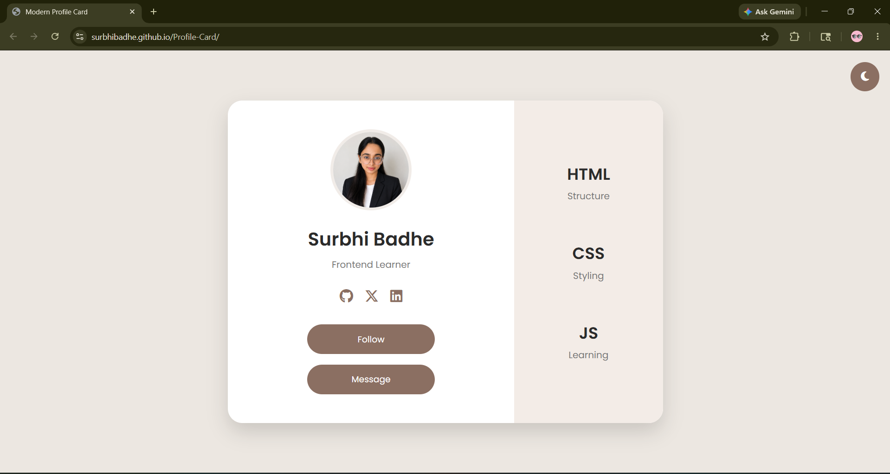

<!-- README.md -->

# Modern Profile Card

A modern and responsive profile card built using HTML, CSS, and JavaScript.

This project focuses on clean UI design, responsive layouts, dark/light mode functionality, smooth animations, and interactive frontend components.

---

## Live Demo

🔗 https://surbhibadhe.github.io/Profile-Card/

---

## Features

- Responsive Design
- Dark / Light Mode Toggle
- Smooth Hover Animations
- Interactive Message Popup
- Font Awesome Icons
- Modern UI Layout
- Flexbox-Based Structure
- Mobile Responsive Design

---

## Journey Note

This project marks one of the first steps in my frontend development journey.

I built this project to practice:

- HTML structure
- CSS layouts
- Responsive design
- JavaScript interactions
- UI styling and animations

The goal was not just to create a profile card, but to understand how modern frontend components are structured and deployed online.

---

## Screenshot



---

## Built With

- HTML5
- CSS3
- JavaScript
- Font Awesome

---

## Project Structure

```bash
Profile-Card/
│
├── index.html
├── style.css
├── script.js
│
├── images/
│   ├── MyImg.png
│   ├── project-preview.png
│
└── README.md
```

---

## Future Improvements

- Add backend message handling
- Improve accessibility
- Add React version
- Store messages dynamically
- Add typing animations
- Create multi-card layouts

---

## Connect With Me

### GitHub
https://github.com/surbhibadhe

### LinkedIn
https://www.linkedin.com/in/surbhi-badhe-901263377/

### X (Twitter)
https://x.com/surbhi_badhe03

---

## Author

**Surbhi Badhe**

Frontend Learner | B.Tech CSE Student
